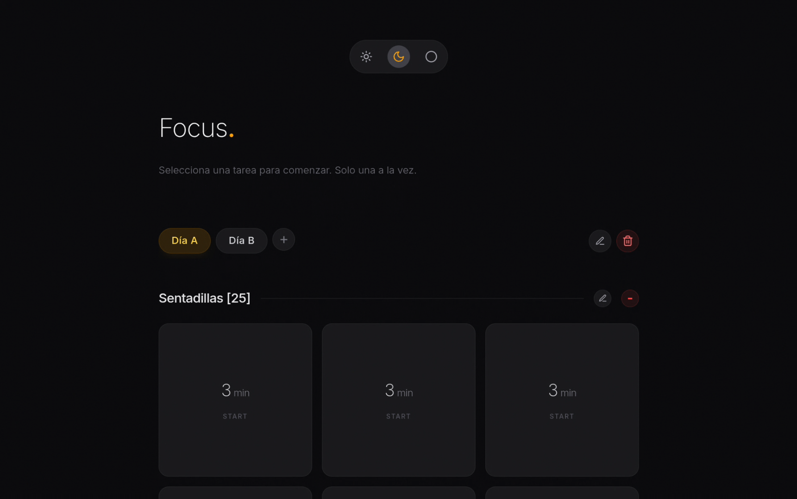
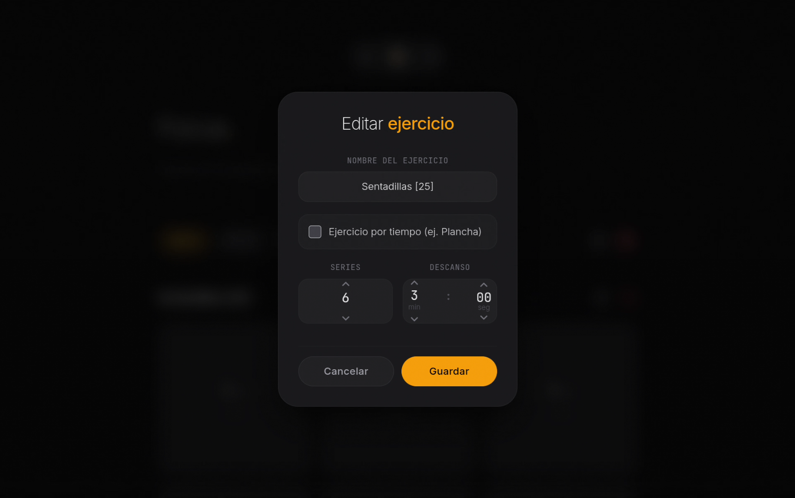
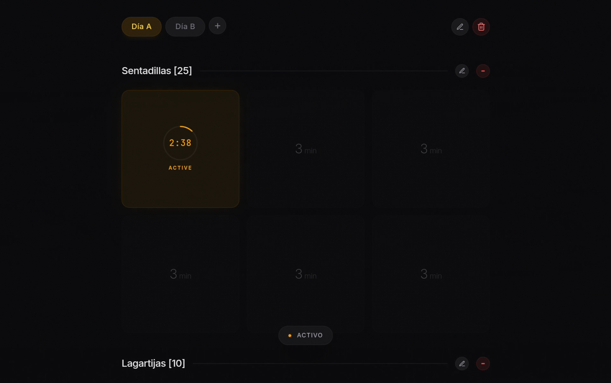

# Focus

**Focus** es una aplicación móvil diseñada para quienes ya entrenan y no necesitan que una app les enseñe a hacer ejercicio. Su objetivo es simple: ayudarte a gestionar, estructurar y cronometrar tus rutinas diarias exactamente como tú quieres.

Tú pones la rutina, **Focus** se encarga del tiempo.

---

## ✨ Características Principales

- **Organización por días:** Agrega y estructura tus ejercicios según el día de la semana que te toque entrenar.
- **Personalización total por ejercicio:** Define cuántas series (sesiones) vas a realizar y cuántas repeticiones tiene cada una.
- **Control del descanso:** Configura temporizadores específicos de recuperación entre series (por ejemplo, 2 o 3 minutos de descanso visualizados de forma clara en pantalla).
- **Modo Tiempo (Isométricos):** Ideal para ejercicios como planchas. Puedes asignarle un tiempo de realización (ej. 1 minuto), iniciar el cronómetro y la app se encargará del conteo regresivo.
- **Flexibilidad absoluta:** Funciona de manera general. No importa si entrenas con peso corporal (calistenia), en el gimnasio o en casa; la app se adapta al equipo que tengas.

---

## 📸 Capturas de Pantalla

|         Vista Principal         |      Detalle de Ejercicio       |         Temporizador en Acción         |
| :-----------------------------: | :-----------------------------: | :------------------------------------: |
|  |  |  |

---

## 🛠️ Tecnologías utilizadas

Esta aplicación fue desarrollada utilizando herramientas modernas de desarrollo web adaptadas para móviles:

**React** - Para la interfaz de usuario dinámica y reactiva.

**Vite** - Como empaquetador y entorno de desarrollo ultra rápido.

**Capacitor** - Para compilar y empaquetar el proyecto web como una aplicación móvil nativa (.apk).

---

## 🚀 Cómo descargar e instalar

Para probar **Focus** en tu dispositivo Android, sigue estos pasos:

1. Ve a la sección de **[Releases](https://github.com/luisvallez/Focus/releases)** en la barra lateral derecha de este repositorio.
2. Descarga el archivo `.apk` de la versión más reciente.
3. Abre el archivo en tu teléfono Android. _(Es posible que tu dispositivo te pida autorizar la instalación de aplicaciones de fuentes desconocidas)._
4. ¡Instala la app y empieza a entrenar!

---

## 📄 Licencia y Términos de Uso

© 2026 Fernando. Todos los derechos reservados.

Este software se distribuye tal cual, únicamente en su formato compilado (`.apk`). Se otorga permiso para la descarga y el uso personal y no comercial de la aplicación. No se permite la redistribución, modificación, descompilación o venta de este archivo ni de sus componentes sin el consentimiento explícito del autor.
